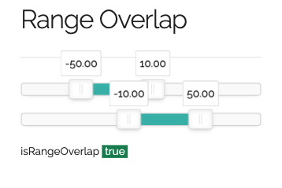

# range-overlap

[](https://www.npmjs.com/package/range-overlap)
[](http://opensource.org/licenses/MIT)


[](https://codecov.io/github/jojoee/range-overlap)
[](https://github.com/semantic-release/semantic-release)
[](https://greenkeeper.io/)
[](https://dashboard.stryker-mutator.io/reports/github.com/jojoee/range-overlap/main)

Are 2 ranges overlap ?, [demo page](https://jojoee.github.io/range-overlap/example/).

[](https://jojoee.github.io/range-overlap/example/)

## Installation

Install with `npm install range-overlap` then

```javascript
// CommonJS
const { isRangeOverlap } = require('range-overlap')

// ES6
import { isRangeOverlap } from "range-overlap"
```

## Example usage

```javascript
// integer and floating numbers as a param
isRangeOverlap(1, 10, 2, 12) // true
isRangeOverlap(1, 10, 2, 8) // true
isRangeOverlap(100, 200, 201, 300) // false

// Date as a param
isRangeOverlap( // true
  new Date(1615452500000),
  new Date(1615452800000),
  new Date(1615452700000),
  new Date(1615452900000),
)

// array of numbers or Date(s) as a param
isRangeOverlap([1, 10], [2, 12]) // true
isRangeOverlap( // true
  [new Date(1615452500000), new Date(1615452800000)],
  [new Date(1615452700000), new Date(1615452900000)]
)

// custom type as a param
isRangeOverlap( // true
  { start: 1, end: 10 },
  { start: 2, end: 12 }
)

// support is-exclusive param
isRangeOverlap(1, 10, 10, 12, true) // false
isRangeOverlap( // false
  new Date(1615452500000),
  new Date(1615452600000),
  new Date(1615452600000),
  new Date(1615452800000),
  true
)
isRangeOverlap([1, 10], [10, 12], true) // false
isRangeOverlap( // false
  [new Date(1615452500000), new Date(1615452600000)],
  [new Date(1615452600000), new Date(1615452800000)],
  true
)
isRangeOverlap({ start: 1, end: 10 }, { start: 10, end: 12 }, true) // false
```

## Algorithm

The detailed logic is described [here](https://stackoverflow.com/questions/325933/determine-whether-two-date-ranges-overlap), but in summary is explained below.
```
2 cases that will not overlapping
case1) |----range1----|  |----range2----|
       x1             x2 y1             y2

case2) |----range2----|  |----range1----|
       y1             y2 x1             x2

so isNotOverlap
= case1) or case2)
= x2 < y1 || y2 < x1

due to isOverlap
= ~isNotOverlap
= ~(x2 < y1 || y2 < x1)
= x2 >= y1 && y2 >= x1
= x1 <= y2 && y1 <= x2
```

## TODO

- [ ] [demo] make it work with vanilla javascript `index.html`
- [ ] [demo] add demo page
- [ ] [CI] auto release with [semantic-release](https://github.com/semantic-release/semantic-release)
- [ ] [CI] run test coverage
- [ ] [CI] upload test coverage to "test report service" e.g. Codecov

## CMD

```bash
npm publish --dry-run
npm publish
npm run format && npm run lint && npm run test && npm run build
npm run version
```

